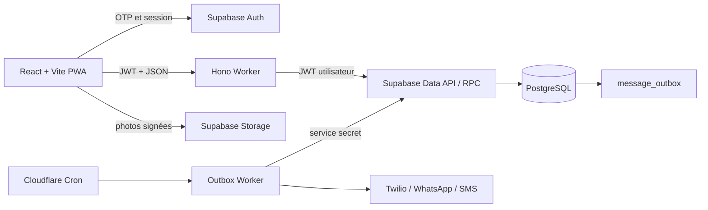
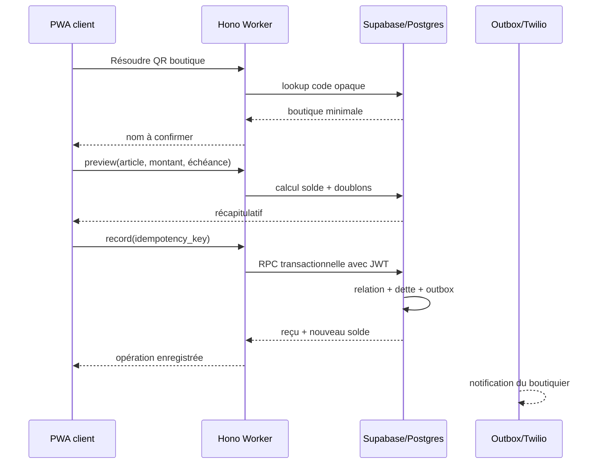

# Architecture système et données

> Statut : décisions acceptées et noyau implémenté localement
> Produit de référence : `PRODUCT.md`
> Date : 30 août 2026

## 1. Objectifs

L’architecture doit garantir simultanément :

- une saisie immédiate par le client ou le boutiquier après l’échange réel ;
- un journal financier immuable ;
- une notification fiable de l’autre partie ;
- des corrections et contestations sans réécriture de l’historique ;
- la détection des doubles saisies probables ;
- un indice de confiance explicable, limité à chaque relation boutique-client ;
- l’isolation stricte des données ;
- une application simple malgré des règles financières fortes.

## 2. Contraintes produit actives

1. L’échange réel vaut accord.
2. Une confirmation numérique de l’autre partie ne bloque jamais le solde.
3. Le serveur doit confirmer l’écriture avant son entrée dans le journal.
4. Les deux parties peuvent enregistrer une dette ou un remboursement.
5. Une correction est une compensation suivie, si nécessaire, d’une nouvelle écriture.
6. Une contestation ne modifie pas le solde enregistré.
7. Les opérations contestées sont exclues du score jusqu’à leur résolution.
8. Le score n’autorise et ne refuse jamais automatiquement un crédit.

## 3. État du schéma actuel

### Réutilisable

- `shops` : identité et propriété d’une boutique ;
- `client_identities` : identité téléphonique vérifiée ;
- `shop_clients` : relation locale entre boutique et client ;
- `ledger_entries` : journal signé et immuable ;
- `dispute_events` : transitions de contestation immuables ;
- `share_links` : relevés privés révocables ;
- `message_outbox` : livraison fiable des notifications ;
- vues des soldes et de la chronologie ;
- idempotence par acteur ;
- RLS et fonctions transactionnelles.

### Évolution implémentée

- les deux acteurs écrivent par la même commande transactionnelle ;
- échéance, canal, rôle d'acteur et doublon probable enrichissent le journal ;
- les remboursements sont alloués FIFO par événements immuables ;
- les métriques et le score v1 sont dérivés ;
- le client vérifié possède un profil minimal ;
- le QR boutique est permanent, hashé et révocable ;
- le frontend ne contient plus de demandes en attente.

Le QR client temporaire reste post-MVP.

## 4. Alternatives de modèle financier

### Option A — Journal central enrichi

Chaque enregistrement confirmé crée directement une ligne dans `ledger_entries`. Les métadonnées nécessaires à l’audit, à la date prévue, à la détection de doublon et au canal d’origine sont portées par cette ligne.

Avantages :

- une seule source de vérité financière ;
- peu de tables supplémentaires ;
- cohérent avec le schéma actuel ;
- écritures, reçus et notifications corrélés par le même identifiant ;
- faible charge cognitive pour le MVP.

Limites :

- la fonction `record_operation` porte davantage de règles ;
- les remboursements nécessitent une structure d’allocation séparée pour le score ;
- il faut bien distinguer métadonnées financières et métadonnées de transport.

### Option B — Opération métier puis écriture comptable

Une table `operations` décrit l’achat ou le remboursement, puis une écriture liée est ajoutée au journal dans la même transaction.

Avantages :

- séparation claire entre le reçu métier et l’impact financier ;
- plus facile d’ajouter reconnaissance, pièces jointes ou détails structurés ;
- meilleure base si Boutikier devient plus tard une plateforme de commandes.

Limites :

- deux sources à synchroniser ;
- davantage de jointures, contraintes et états ;
- risque d’introduire par erreur un cycle de demandes en attente ;
- complexité disproportionnée pour le produit actuel.

### Recommandation

Retenir **l’option A**, le journal central enrichi. Le produit documente un échange déjà réalisé ; il n’a pas besoin d’une couche de commande séparée.

## 5. Modèle de données recommandé

### 5.1 Identité

#### `shops` — existant

Une boutique appartient à un seul compte authentifié pour le MVP.

Champs importants :

- `id`
- `auth_user_id`
- `name`
- `phone_e164`
- `currency_code`
- `archived_at`

#### `client_identities` — existant

Représente le téléphone vérifié, pas la fiche commerciale d’une boutique.

#### `client_profiles` — nouveau

Profil global minimal du client authentifié :

- `auth_user_id`, clé primaire liée à Supabase Auth ;
- `display_name` ;
- `avatar_path`, facultatif ;
- `created_at` ;
- `updated_at`.

Le nom commercial local reste dans `shop_clients`, car une boutique peut connaître le client sous un autre nom.

#### `shop_clients` — existant

Reste l’agrégat de la relation. C’est aussi la portée de l’indice de confiance.

Lorsqu’un client vérifié scanne une boutique pour la première fois, une fonction transactionnelle crée ou retrouve cette relation à partir de son identité et de son profil.

### 5.2 QR

#### `shop_public_codes` — nouveau

- `id`
- `shop_id`
- `token_hash`
- `created_at`
- `revoked_at`
- `last_used_at`, facultatif

Le QR contient un token aléatoire d’au moins 128 bits. La base conserve uniquement son hash. Un code révoqué n’est jamais affecté à une autre boutique.

#### `client_qr_sessions` — post-MVP

- `id`
- `client_identity_id`
- `token_hash`
- `expires_at`
- `used_at`
- `revoked_at`

Ce QR est temporaire et, de préférence, utilisable une seule fois.

### 5.3 Journal

#### `ledger_entries` — à enrichir

Champs existants conservés :

- boutique et relation ;
- type `debt`, `repayment`, `correction` ;
- montant signé ;
- référence de correction ;
- titre et détail ;
- dates d’opération et d’enregistrement ;
- acteur ;
- clé d’idempotence.

Champs proposés :

- `due_on date`, uniquement pour une dette ;
- `source_channel`, parmi `app`, `shop_qr`, `whatsapp_assisted`, `shared_link` ;
- `possible_duplicate_of uuid`, facultatif et non bloquant ;
- `client_reference text`, identifiant lisible du reçu ;
- `recorded_by_role`, `shop` ou `client`, figé pour l’audit.

Le rôle ne sert pas seul à autoriser. L’autorisation est toujours recalculée depuis `auth.uid()` et les relations en base.

### 5.4 Allocation des remboursements

L’indice de confiance exige de savoir quand chaque dette est réellement réglée. Le solde global ne suffit pas.

#### Alternative 1 — allocation automatique FIFO

Le serveur affecte chaque remboursement aux plus anciennes dettes non réglées de la relation.

Avantages : aucune saisie supplémentaire et résultat déterministe.

Limite : le client peut avoir voulu régler une dette plus récente.

#### Alternative 2 — allocation choisie par l’utilisateur

L’utilisateur sélectionne les dettes réglées.

Avantage : intention exacte.

Limites : interface plus lente, erreurs fréquentes et peu adaptée au public cible.

#### Recommandation

Retenir **FIFO automatique pour le MVP**, avec affichage de l’allocation dans le reçu. Une allocation manuelle pourra être ajoutée ultérieurement.

#### `repayment_allocation_events` — nouveau et immuable

- `id`
- `shop_client_id`
- `repayment_entry_id`
- `debt_entry_id`
- `event_type`, `allocated` ou `released`
- `amount_xof`, toujours positif
- `recorded_at`

La somme nette allouée ne peut dépasser ni le remboursement ni la dette. Une correction libère automatiquement les allocations concernées par de nouveaux événements ; rien n’est supprimé.

### 5.5 Contestations et reconnaissance

`dispute_events` reste la source de vérité des contestations.

Une reconnaissance facultative peut utiliser plus tard `acknowledgement_events`, mais elle n’est pas nécessaire au MVP. Une absence de reconnaissance ne change jamais le solde.

### 5.6 Notifications

`message_outbox` reste utilisé. Les nouveaux événements sources sont toujours des écritures, contestations, corrections, liens et vérifications.

Le payload financier n’est pas nécessairement dupliqué dans l’outbox. Le worker charge le reçu depuis la source au moment de l’envoi.

Pour un numéro non vérifié, le rendu du message est générique et ne contient aucune donnée financière.

## 6. Indice de confiance

### 6.1 Portée

Le score appartient à `shop_clients`, donc à une seule relation boutique-client.

### 6.2 Source

Le score est une projection dérivée, pas une valeur modifiable par une application.

Sources utilisées :

- dettes effectivement réglées ;
- date prévue lorsqu’elle existe ;
- date de règlement final calculée depuis les allocations ;
- fréquence et régularité des remboursements ;
- paiements partiels ;
- retards.

Exclusions :

- dettes ou remboursements avec contestation ouverte ;
- écritures compensées ;
- opérations encore non réglées pour les métriques de délai final.

### 6.3 Calcul ou stockage

#### Option calculée à la lecture — recommandée au MVP

Les vues `client_trust_metrics` et `client_trust_scores` exposent les faits et le score v1. Elles ne retournent des lignes qu'au client lié; le rôle privilégié reste disponible pour les tâches internes.

Avantages : formule modifiable, explication simple, aucune donnée dérivée périmée.

#### Option snapshots persistés

Une table conserve chaque version du score après une opération.

Avantages : audit historique exact et lectures rapides.

Limites : synchronisation et migration de formule plus complexes.

Le snapshot ne devient utile qu’après validation de la formule et apparition d’un besoin d’historique.

### 6.4 Règle v1

Le client reste dans l'état `Nouveau` jusqu'à trois dettes éligibles entièrement réglées. La formule combine règlement, ponctualité, délai moyen et paiements partiels. Elle reste consultative et pourra être versionnée après observation terrain.

## 7. Détection des doublons

L’idempotence empêche le même appareil de répéter une requête. Elle ne détecte pas une saisie du même achat par les deux parties.

### Prévisualisation

Avant l’écriture, `POST /api/operations/preview` retourne :

- la contrepartie ;
- le nouveau solde estimé ;
- les notifications prévues ;
- les opérations proches par type, montant et fenêtre temporelle.

### Enregistrement

`POST /api/operations` appelle une seule fonction transactionnelle. La base refait la recherche de doublon afin de couvrir les courses concurrentes.

Si un doublon probable existe :

- l’écriture n’est pas créée au premier essai ;
- l’API retourne `409 probable_duplicate` et la référence candidate ;
- l’utilisateur peut annuler ou confirmer `Enregistrer quand même` ;
- l’écriture forcée conserve `possible_duplicate_of`.

Cette vérification prévient sans décider à la place des utilisateurs.

## 8. Fonctions transactionnelles

### `record_operation`

Responsabilités :

1. authentifier l’acteur ;
2. vérifier qu’il possède la boutique ou l’identité client liée ;
3. retrouver ou créer la relation après un QR boutique valide ;
4. valider montant, type, date et devise ;
5. appliquer l’idempotence ;
6. vérifier le doublon probable ;
7. insérer l’écriture ;
8. allouer un remboursement si nécessaire ;
9. insérer le message dans l’outbox ;
10. retourner l’écriture, le nouveau solde et le reçu.

Tout réussit ou tout échoue dans une seule transaction Postgres.

### `correct_entry`

Ajoute la compensation exacte. Si l’écriture corrigée participe à des allocations, ajoute les événements de libération correspondants.

Une nouvelle valeur corrigée est créée par un second appel explicite à `record_operation`, conformément au journal immuable.

### `change_dispute_state`

Conserve le modèle événementiel actuel. L’ouverture d’une contestation affecte immédiatement les projections contestées et le score, jamais le solde enregistré.

## 9. Architecture applicative

### Alternative A — frontend directement sur Supabase

Le navigateur appelle Supabase Data API pour lire et les RPC pour écrire. Le Worker ne gère que les liens privés, Twilio et l’outbox.

Avantages : peu de code API et RLS appliquée naturellement.

Limites : contrats répartis entre frontend et Postgres, observabilité fragmentée et exposition plus directe du schéma.

### Alternative B — Worker comme façade métier

Le navigateur utilise Supabase Auth pour la session, puis appelle uniquement le Worker pour les données métier. Le Worker transmet le JWT utilisateur aux appels Supabase afin que RLS et `auth.uid()` restent actifs.

Avantages : API Zod unique, schéma moins couplé au frontend, journalisation cohérente et évolution plus contrôlée.

Limites : un saut HTTP supplémentaire et plus de code serveur.

### Recommandation

Retenir **l’alternative B** : Auth Supabase côté PWA, Hono Worker comme façade métier, Postgres comme autorité transactionnelle.

Le Worker utilise la Data API Supabase via HTTP. Une connexion TCP ou Hyperdrive n’est pas nécessaire au MVP ; cela évite de créer une connexion Postgres depuis chaque invocation.

## 10. Communication entre composants

### Secrets

- clé publique Supabase dans la PWA ;
- secrets Twilio et clé Supabase privilégiée uniquement dans les secrets Worker ;
- aucune clé `service_role` dans le navigateur ;
- opérations métier ordinaires exécutées avec le JWT utilisateur, pas avec `service_role`.

## 11. Flux principaux

### Dette enregistrée par le client après scan

### Remboursement

Le même flux s’applique sans QR lorsqu’une relation existe. La transaction crée l’écriture négative, les allocations FIFO et le reçu, puis notifie l’autre partie.

### Hors connexion

Le formulaire reste un brouillon local avec une clé d’idempotence stable. Il n’apparaît jamais dans le journal avant la réponse positive du serveur.

## 12. Accès et RLS

| Donnée | Boutiquier | Client lié | Anonyme | Worker privilégié |
| --- | --- | --- | --- | --- |
| Boutique | Propriétaire | Identité publique minimale | Via code opaque seulement | Oui |
| Relation | Sa boutique | Sa propre identité | Non | Oui |
| Journal | Sa boutique | Sa relation | Non | Oui |
| Contestations | Sa boutique | Sa relation | Non | Oui |
| Score | Non | Sa relation | Non | Oui |
| Lien partagé | Créateur | Via lien valide | Lecture privée limitée | Oui |
| Outbox | Non direct | Non direct | Non | Oui |

Chaque table exposée reçoit explicitement RLS et des `GRANT`. Supabase ne garantit plus l’exposition automatique des nouvelles tables au Data API ; l’architecture doit donc rester explicite sur les privilèges.

## 13. API proposée

### Identité et relations

- `GET /api/me`
- `GET /api/shops`
- `GET /api/shops/:shopId/clients`
- `GET /api/relationships/:id`
- `POST /api/qr/shops/resolve`

### Opérations implémentées

- `POST /api/operations`
- `GET /api/shop/summary?period=today|7d|month|all`
- `POST /api/shop/qr`
- `POST /api/shop/connect`

Les lectures du journal, corrections, contestations et liens privés sont le prochain raccordement HTTP; leurs RPC et règles existent déjà en base.

### Synthèses

- `GET /api/shop/summary?period=today|7d|month|all`
- `GET /api/relationships/:id/trust`

### Partage

- `POST /api/relationships/:id/share-links`
- `DELETE /api/share-links/:id`
- `GET /s/:token`

## 14. Indexes prévus

- journal par relation et chronologie ;
- journal par boutique et date d’enregistrement ;
- journal par acteur et clé d’idempotence, unique ;
- dettes ouvertes par relation et échéance ;
- allocations par dette et remboursement ;
- contestation la plus récente par écriture ;
- code QR actif par hash, unique et partiel ;
- outbox par statut et disponibilité ;
- recherche de doublon par relation, type, montant et date.

Les indexes exacts seront validés avec les requêtes réelles et `EXPLAIN`, pas ajoutés par anticipation sans usage.

## 15. Déploiement progressif

### Lot 1 — alignement du journal — implémenté localement

- autoriser les deux acteurs ;
- ajouter date prévue et canal ;
- ajouter allocation FIFO ;
- ajouter synthèses par période ;
- retirer le modèle de demande en attente du frontend.

### Lot 2 — confiance — noyau implémenté

- vue des métriques ;
- formule versionnée ;
- explication du score ;
- exclusion des contestations ouvertes.

### Lot 3 — QR boutique — modèle et API implémentés

- codes permanents et révocables ;
- résolution et confirmation ;
- création automatique de relation ;
- fallback WhatsApp et code manuel restent à raccorder.

### Lot 4 — QR client et reconnaissance

- sessions QR temporaires ;
- scan côté boutiquier ;
- reconnaissance facultative des écritures.

## 16. Décisions retenues

1. Journal central enrichi.
2. Allocation FIFO automatique et réversible.
3. Façade Hono unique avec JWT utilisateur transmis à Supabase.
4. État `Nouveau` jusqu'à trois dettes éligibles réglées.
5. `409 probable_duplicate`, puis confirmation explicite pour enregistrer quand même.

## 17. Sources techniques vérifiées

- [Supabase Row Level Security](https://supabase.com/docs/guides/database/postgres/row-level-security)
- [Supabase Database Functions](https://supabase.com/docs/guides/database/functions)
- [Supabase changelog](https://supabase.com/changelog.md)
- [Cloudflare Workers : connexion aux bases et Supabase](https://developers.cloudflare.com/workers/databases/connecting-to-databases/)
- [Cloudflare Workers : Hono](https://developers.cloudflare.com/workers/framework-guides/web-apps/more-web-frameworks/hono/)

Le changelog Supabase consulté le 30 août 2026 confirme notamment que les nouvelles tables ne sont plus automatiquement exposées au Data API par défaut. Les migrations devront donc déclarer explicitement les privilèges en plus de RLS.
